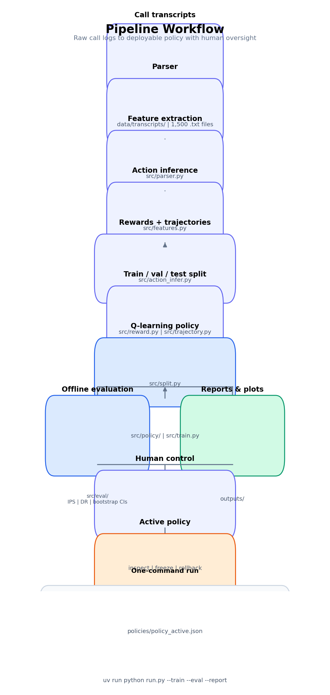

# Fixit AI — Voicebot RL

Reinforcement learning system that learns a **turn-level dialogue policy** from 1,500 unlabeled real-estate voicebot call transcripts.

## Pipeline workflow

End-to-end flow from raw call logs to a deployable policy with human oversight:



| Stage | CLI flag | Main outputs |
|---|---|---|
| Parse | `--parse-only` | `outputs/parse_report.json` |
| Features | `--extract-features` | `outputs/bot_states.parquet` |
| Actions | `--infer-actions` | `outputs/mdp_rows.parquet` |
| Trajectories | `--build-trajectories` | `outputs/trajectories.parquet` |
| Train | `--train` | `policies/policy_learned_v1.json`, `outputs/learning_curve.png` |
| Evaluate | `--eval` | `outputs/eval_report.json` |
| Full run | `--train --eval --report` | `outputs/final_report.json` |
| Human gate | `--inspect`, `--freeze`, `--rollback` | `policies/policy_active.json`, `policies/registry.json` |

## Prerequisites

- [uv](https://docs.astral.sh/uv/) installed

```bash
# Windows (PowerShell)
powershell -ExecutionPolicy ByPass -c "irm https://astral.sh/uv/install.ps1 | iex"
```

## Setup

From the project root:

```bash
uv sync
```

This creates `.venv/`, installs locked dependencies from `uv.lock`, and includes dev tools (pytest).

Call transcripts live in `data/transcripts/` (1,500 `.txt` files). Override the path with `--data` or `configs/default.yaml`.

To include dev dependencies explicitly:

```bash
uv sync --group dev
```

## Quick start

Full pipeline run: train a policy, evaluate it offline, and write the final report.

```bash
uv run python run.py --train --eval --report
```

Launch the Streamlit dashboard to understand the pipeline visually:

```bash
uv run streamlit run streamlit_app.py
```

In the dashboard, open the **Run Files** tab to execute parser, feature extraction,
action inference, trajectory building, training, evaluation, reporting, or tests
directly from the UI and view the generated result artifacts.

### Streamlit dashboard

Open the dashboard with `uv run streamlit run streamlit_app.py`. The **Overview** tab shows baseline vs learned returns, the learning curve, and quick commands. The **Run Files** tab lets you run pipeline steps from the browser and inspect generated artifacts.

Parse all transcripts and print statistics:

```bash
uv run python run.py --parse-only
```

Extract bot decision state features:

```bash
uv run python run.py --extract-features
```

Infer bot actions and build MDP rows:

```bash
uv run python run.py --infer-actions
```

Build full trajectories with rewards:

```bash
uv run python run.py --build-trajectories
```

Train Q-learning policy and generate learning curve:

```bash
uv run python run.py --train
```

Offline policy evaluation with IPS + Doubly Robust CIs:

```bash
uv run python run.py --eval
```

Inspect, constrain, and roll back policies (human control):

```bash
uv run python run.py --inspect
uv run python run.py --inspect --diff baseline learned_v1
uv run python run.py --freeze configs/freeze_rules.yaml
uv run python run.py --rollback baseline
```

Or specify the data directory explicitly:

```bash
uv run python run.py --data data/transcripts --extract-features
```

## Run tests

```bash
uv run pytest
```

Quiet mode:

```bash
uv run pytest -q
```

## Common uv commands

| Command | Purpose |
|---|---|
| `uv sync` | Install / update dependencies from lockfile |
| `uv run <cmd>` | Run a command inside the project venv |
| `uv add <package>` | Add a runtime dependency |
| `uv add --group dev <package>` | Add a dev dependency |
| `uv lock` | Regenerate `uv.lock` after changing `pyproject.toml` |

## Outputs

After `--parse-only`, results are written to `outputs/parse_report.json`.

After `--extract-features`:
- `outputs/bot_states.parquet` — one row per bot turn (~10k+ states)
- `outputs/feature_report.json` — feature means and non-zero rates
- `outputs/feature_names.json` — ordered feature name list

After `--infer-actions`:
- `outputs/mdp_rows.parquet` — state features + inferred action per bot turn
- `outputs/action_report.json` — action distribution and context mismatch rate

After `--build-trajectories`:
- `outputs/trajectories.parquet` — full (s, a, r) transitions with reward breakdown
- `outputs/reward_report.json` — baseline mean return and reward component counts

After `--train`:
- `policies/policy_learned_v1.json` — tabular Q-policy with behaviour constraints
- `outputs/learning_curve.png` — validation return per epoch
- `outputs/train_report.json` — baseline vs learned val return

After `--eval`:
- `outputs/eval_report.json` — IPS + DR estimates, 95% bootstrap CIs, assumptions

After `--train --eval --report`:
- `outputs/final_report.json` — final baseline vs learned comparison
- `policies/registry.json` — active policy version and rollback records

Human-control files:
- `configs/freeze_rules.yaml` — hard rules that force safe actions for risky states
- `policies/policy_baseline_v0.json` — behavior-policy fallback
- `policies/policy_learned_v1.json` — versioned learned policy
- `policies/policy_active.json` — active deploy policy used by default evaluation

## System capabilities

| Capability | Where to find it |
|---|---|
| End-to-end pipeline | `uv run python run.py --train --eval --report` |
| Learns against baseline | `outputs/train_report.json`, `outputs/learning_curve.png` |
| Offline evaluation with assumptions and error bars | `outputs/eval_report.json` |
| Defensible reward design | `src/reward.py`, `outputs/reward_report.json`, `docs/DESIGN.md` |
| Human inspect / constrain / rollback | `--inspect`, `--freeze`, `--rollback` |
| Design and architecture notes | `docs/DESIGN.md` |
